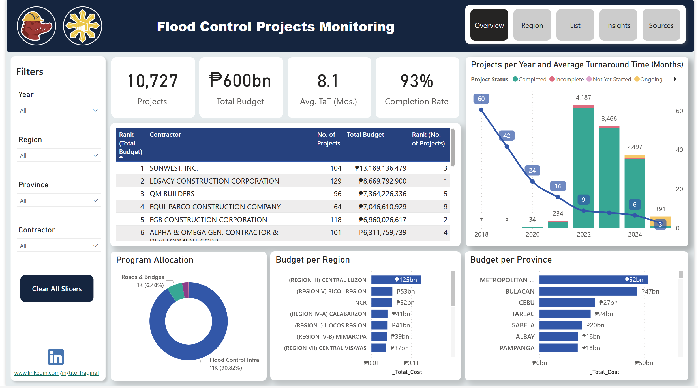

# Tito Fraginal Power BI Portfolio
## Data Analytics Portfolio

# Project 1: PH Flood Control Monitoring Dashboard

This was my entry for the Power BI Pilipinas Community Data Challenge 2025 featuring flood control data extracted from Project DIME (Digital Information for Monitoring and Evaluation)
This dashboard was one of the Top 10 Winners out of 50+ entries

# Project 2: Adventure Works Dashboard

This dashboard features the data from Microsoft's AdventureWorks Database, a Microsoft product sample for an online transaction processing(OLTP) database. The AdventureWorks database supports a fictitious, multinational manufacturing company called Adventure Works Cycles

# Project 3: Hardware Sugar Price Watch

This dashboard features local Philippine pricing data of computer hardware such as GPU, CPU, RAM and storage from Hardware Sugar's Price Watch Sheet and historical data from shopee items. 
This was created to analyze the price trend of computer hardware due to the The "AI Boom RAM-pocalypse" which refers to the current, severe shortage and skyrocketing prices of computer memory (RAM) driven by massive AI data center demand, squeezing consumers and PC builders as manufacturers shift focus to high-margin AI chips, leading to price hikes on laptops, gaming PCs, and more, with some predicting shortages lasting into 2027-2028
